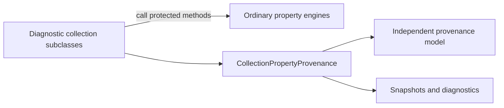

/*
 * Copyright 2026 Gradle and contributors.
 *
 * Licensed under the Creative Commons Attribution-Noncommercial-ShareAlike 4.0 International License.
 * You may not use this file except in compliance with the License.
 * You may obtain a copy of the License at
 *
 *      https://creativecommons.org/licenses/by-nc-sa/4.0/
 *
 * Unless required by applicable law or agreed to in writing, software
 * distributed under the License is distributed on an "AS IS" BASIS,
 * WITHOUT WARRANTIES OR CONDITIONS OF ANY KIND, either express or implied.
 * See the License for the specific language governing permissions and
 * limitations under the License.
 */

# Property provenance: collection diagnostic adapters

This review increment refactors D2 commit `37d47151c7bacf17cabc761acbb7ee7b5eb48e96`.
The roadmap remains `d71ed7bafde06b54faa1810b64f563c41616ddb0`; D3 transport is not
implemented. No new property scope, source locations or collaboration behavior is added.

## Separation boundary

`AbstractProperty`, `AbstractCollectionProperty` and `DefaultMapProperty` contain **no
diagnostic observer calls, operation guards, provenance bookkeeping or diagnostic failure
handling**. They expose the existing
protected mutation/supplier methods, with no observer interface or runtime diagnostic
branches. The probe checks their compiled bytecode for references to diagnostic classes,
provenance classes and observer contracts.

`DiagnosticListProperty`, `DiagnosticSetProperty` and `DiagnosticMapProperty` own all
integration: wrapping mutations, catching failures, capturing suppliers, and completing
finalization checkpoints after the engine succeeds. For example, `discardConvention()`
in `AbstractProperty` only checks mutability and applies the default convention. Its
diagnostic override calls `super.discardConvention()`, reports the accepted clear to
the helper, and decorates any rejection.



The shared `CollectionPropertyProvenance` helper owns operation state, contribution
classification, accepted-state changes, model labels, replacement classification,
snapshot construction, finalization freezing and failure rendering. Primitive operation
tokens restore nested context without allocating a per-call wrapper. The read-only
`CollectionPropertyDiagnostics` interface shares the explanation surface among enabled
subclasses; ordinary engines do not implement it.

The descriptor model remains in `org.gradle.api.internal.provenance`, independent of
Provider and property engine types. The concrete adapters remain in the provider package
to access the engine integration methods. There is no new evaluator or authorization
policy; values and dependencies are still calculated by the existing engine.

## Deliberate forwarding and storage

The diagnostic collection subclasses use shared semantic decisions and typed forwarding. Typed forwarding methods and try/finally boundaries remain in those classes
so that the ordinary engines have no diagnostic control flow. Shared semantic decisions
live in the helper. This trades some repeated forwarding for a clear separation.

No observer interface remains. Default properties gain no fields, registry or mandatory
mutation history. Scalar adapters retain their existing integration. Further scalar
adapter consolidation and D3 transport are outside this refactor.

## Validation

**2,193 tests passed:** 2,165 unit tests and 28 embedded integration tests. The suites
cover D2 mutations, source selection, named reporting, copies, finalization, circular
evaluation, ordinary collection behavior and ordinary/attributed scalar behavior.
Six additional cases verify recovery after failed finalization and nested replacement
callback failure across list, set and map properties. Java Checkstyle and Groovy CodeNarc
passed.

Full validation scan: https://ge.gradle.org/s/ny64lsgn5qe3i

Final unit tests including the six recovery cases, and CodeNarc:
https://ge.gradle.org/s/2cuhw4zasa7cm

Use the D2 checkpoint's validation command with these additional unit selectors:

```text
--tests '*DefaultPropertyTest' --tests '*AttributedDefaultPropertyTest'
```

## Focused allocation, retention and dependency evidence

[Raw evidence](testing/performance/provenance/d2-hooks-probe-20260907.json) uses the
unmodified S0 distribution, three rotated JVM forks and five warmup/measurement batches.
[The manifest](testing/performance/provenance/d2-hooks-evidence-20260907.json) binds this
implementation and its tests to the evidence. Historical committed D2 artifacts remain
unchanged. The `hooks` filenames identify this review increment; all diagnostic hooks
are now in the diagnostic subclasses.

Representative medians in allocated bytes per operation:

| Workload | Disabled | Enabled | D2 enabled before refactor |
| --- | ---: | ---: | ---: |
| List binding | 176 | 240 | 240 |
| Map binding | 176 | 264 | 264 |
| List copy | 24 | 40 | 40 |
| Contribution plus reset, list | 248 | 368 | 368 |
| List, construct 4,096 contributions | 345,376 | 574,992 | 574,992 |

Disabled shallow property sizes remain 40 bytes for list/set and 48 for map, matching
the unmodified baseline. Enabled sizes remain 48/56 bytes respectively, plus the
32-byte adapter and 48-byte descriptor state. Each retained contribution adds 56 bytes
of occurrence/sequence metadata with constant-time append. Representative enabled
allocations are unchanged. The disabled map binding measurement is 176 bytes in this
run versus 200 in the earlier observer run; JIT-sensitive differences are not a stable
performance improvement claim.

All 36 enabled unwanted-reference checks reported zero. Engine-snapshot checks still
show inherited empty/finalized owner retention; populated enabled snapshots release
the owner. The descriptor package compiles standalone with only JDK/JSpecify dependencies.
All three engine bytecode boundary checks passed. This bounded probe establishes no
production throughput, startup/classloading or runtime overhead percentage guarantee.
No long performance campaign was run.

Reproduce after compiling model-core:

```sh
python3 testing/performance/provenance/run-collection-probe.py \
  --baseline-zip /tmp/provenance-s0-20260907/gradle-9.9.0-bin.zip \
  --output testing/performance/provenance/d2-hooks-probe-20260907.json
```

No blocking decision remains for this refactor. D3 transport remains the next milestone.

## Bulk rejection labels

The squashed D2 change also distinguishes preserving bulk calls at the protected
`withActualValue` boundary. A boolean identifies bulk calls without introducing
provenance types or diagnostic control flow into the ordinary engines. Diagnostic
adapters use it to report `appendAll` and `insertAll` rejections accurately, including
list/set varargs calls that fail before attaching a collector. Eight regression cases
cover iterable/map, provider and varargs inputs across the three collection types.

The September 7 manifests and performance measurements above describe the pre-fix
source revisions recorded in those artifacts; they have not been regenerated for
this label correction.
